# AWS Platform

**English** | [简体中文](README.zh-CN.md)

A native macOS app for read-only browsing of AWS resources and costs, built with SwiftUI.

## Download

[Version 0.2.0](https://github.com/maydaychen/aws-platform/releases/tag/v0.2.0) requires **macOS 13 or later**. Choose the package for your Mac:

| Mac | Installer | Archive |
| --- | --- | --- |
| Apple Silicon (M-series, `arm64`) | [DMG](https://github.com/maydaychen/aws-platform/releases/download/v0.2.0/AWSPlatform-0.2.0-arm64.dmg) | [ZIP](https://github.com/maydaychen/aws-platform/releases/download/v0.2.0/AWSPlatform-0.2.0-arm64.zip) |
| Intel (`x86_64`) | [DMG](https://github.com/maydaychen/aws-platform/releases/download/v0.2.0/AWSPlatform-0.2.0-x86_64.dmg) | [ZIP](https://github.com/maydaychen/aws-platform/releases/download/v0.2.0/AWSPlatform-0.2.0-x86_64.zip) |

Open the DMG and drag AWSPlatform to Applications, or extract the ZIP. Both builds are Developer ID signed and notarized by Apple. [SHA-256 checksums](https://github.com/maydaychen/aws-platform/releases/download/v0.2.0/SHA256SUMS.txt) are available with the release. AWS CLI v2 is required for SSO sign-in; see [Prerequisites](#prerequisites).

## Features

- **EC2 instances** - View instance state, networking, AMIs, and tags
- **Lambda functions** - View function configuration and source code from deployment packages
- **Metrics and logs** - Manually query CloudWatch metrics for EC2 and Lambda, and logs for the current Lambda function, with time ranges, log filters, and pagination
- **S3 buckets** - Browse bucket security settings, objects, and folders
- **CloudWatch alarms** - View Metric and Composite Alarms in the current Region, including state, configuration, action targets, tags, and the last 30 days of history
- **SNS topics** - Browse Standard and FIFO Topics, attributes, policies, tags, and subscriptions, with subscription endpoints hidden by default
- **Route 53** - Browse public and private Hosted Zones, DNS record sets, delegation name servers, VPC associations, and tags for the current account
- **Load balancing** - Browse ALB, NLB, GWLB, listeners, ALB rules, Target Groups, and target health; follow resource links and manually find an EC2 instance's registered Target Groups
- **Security groups** - Browse visible groups, owners, VPCs, tags, and inbound/outbound rules in the current Profile and Region
- **Resource relationships** - Explore Route 53 records, load balancers, Target Groups, EC2 instances, and security groups one hop at a time, with explicit reverse queries and precise resource navigation
- **AWS Health events** - View account-specific events across regions for the current Profile, with search, filters, event descriptions, and affected resources
- **Separate Session and Profile selection** - Sign in to a session, then manually choose an associated Profile and Region; resource views stay empty until a Profile is selected
- **SSO login** - Click `SSO Login` in the app to authorize a session through your browser, or reuse a login cached by the CLI
- **Cost dashboard** - View current-month and previous-month costs, daily trends, and service breakdowns for the current Profile's account, with independent date and billing Region filters, in-memory caching, and manual refresh
- **Resource favorites** - Save EC2 instances, Lambda functions, S3 Buckets, CloudWatch Alarms, SNS Topics, Route 53 Hosted Zones, load balancers, Target Groups, and security groups locally; reopen them within the current Profile, restoring the saved Region for regional resources
- **Recent resources** - Reopen recently viewed resources in the current Profile and account, with local history, search, and scoped deletion
- **Interface language** - Follow the system language, or choose Simplified Chinese or English; switch instantly without reloading AWS data
- **Native desktop layout** - Compact service navigation, resource lists with counts, adaptive detail grids, and system-aware light and dark themes

The app does not create, modify, or delete resources, or invoke Lambda functions.

The following component previews use mock resources:

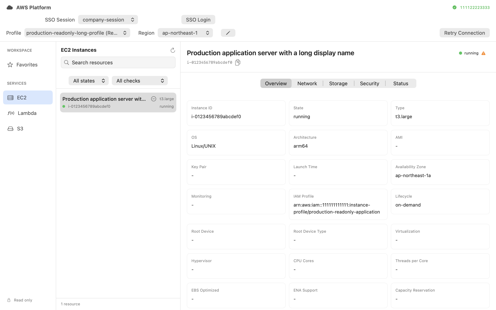

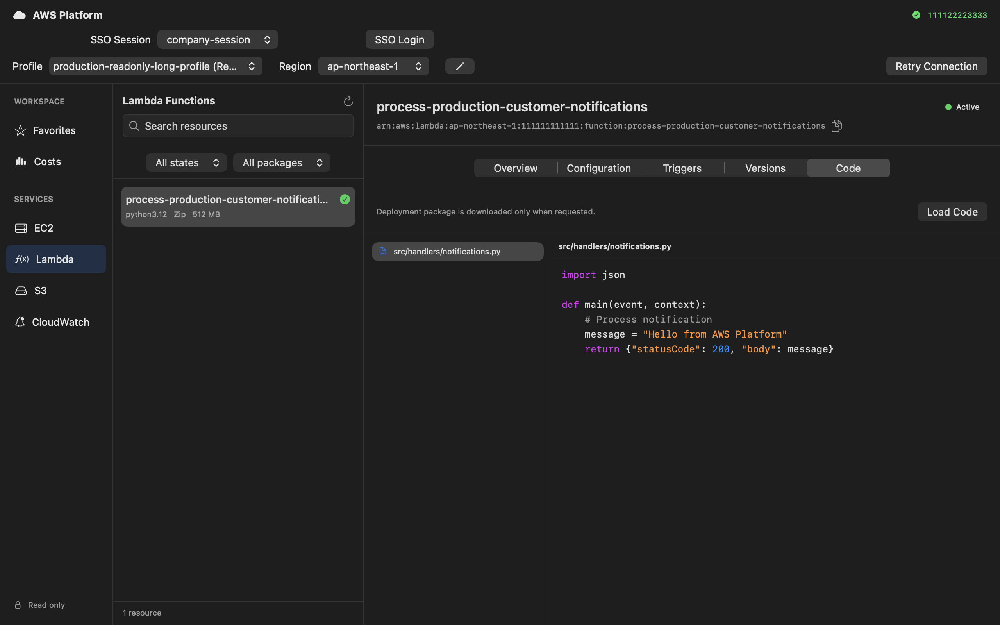

## Technology Stack

- Swift 6.2+ / SwiftUI (toolchain required to build from source)
- macOS 13+, supporting Intel (x86_64) and Apple Silicon (arm64)
- [Soto](https://github.com/soto-project/soto) - AWS SDK for Swift

## Quick Start

### Prerequisites

- macOS 13.0+ to run the app
- A full Xcode installation with Swift 6.2+ to build from source; the build machine must meet that Xcode version's macOS requirements
- AWS CLI configuration (`~/.aws/config` and `~/.aws/credentials`)
- For SSO, configure a named `sso-session` and install AWS CLI v2. Click `SSO Login` in the app or run `aws sso login --sso-session <name>` in a terminal. Browsing resources also requires a Profile that references the session

On Apple Silicon, use an AWS CLI version that runs natively. Starting with version 2.30.0, AWS CLI v2 provides an [official Universal installer](https://aws.amazon.com/blogs/devops/introducing-universal-installers-for-aws-cli-v2-on-macos/) for both Intel and Apple Silicon; older Intel-only versions cannot run on Apple Silicon without Rosetta.

### Build and Run

```bash
# Clone the repository
git clone https://github.com/maydaychen/aws-platform.git
cd aws-platform

# Build
swift build

# Run
swift run

# Test
swift test
```

### Xcode

```bash
open Package.swift
```

Press Cmd+R in Xcode to run the app.

The package manifest declares Swift tools 5.9, but some dependencies currently pinned in `Package.resolved` require Swift 6.2+. Use a toolchain that meets this requirement.

### Package a Universal App

Select a full Xcode toolchain with Swift 6.2+, then run this command from the repository root:

```bash
./scripts/build-universal.sh
```

The script uses the dependencies pinned in `Package.resolved`, builds Release versions for Intel and Apple Silicon, and combines them into a Universal app. It produces:

- `dist/AWSPlatform.app`: an app for both architectures on macOS 13 or later, ready to copy to the Applications folder.
- `dist/AWSPlatform-universal.zip`: an archive containing the app.

These local builds use ad-hoc signing. Both packaging scripts accept `--architecture arm64` for Apple Silicon, `--architecture x86_64` for Intel, or `--architecture universal` (the default) for both. Single-architecture builds contain only that architecture, including embedded Swift runtime libraries. Use separate `--output-dir` directories when keeping multiple local builds. Version and build number can be set with `--version` and `--build-number`.

For distribution, use `scripts/package-distribution.py` with the same architecture/version options to sign with a local Developer ID Application identity, notarize with Apple, and staple the tickets. It produces versioned ZIP and DMG files named `AWSPlatform-<version>-<architecture>`, checksums, and notarization records. A valid signing identity and configured `asc` authentication are required; see the [distribution packaging instructions (Chinese)](scripts/README.md#正式签名与公证). A regular `swift build` still builds only for the current machine's architecture.

### Interface Language

Open `Settings` at the bottom of the sidebar or press `Cmd+,`. Choose `Follow System`, `简体中文`, or `English`. The choice is saved locally and applies immediately to every open app window. Unsupported system languages fall back to English.

Changing the language preserves the selected Session, Profile, Region, filters, resources, and loaded results. It does not log in, validate credentials, or send AWS requests. Service names, resource names, IDs, ARNs, AWS tags, logs, and event descriptions retain their original content. Native macOS menu labels follow the system language.

For contributor guidance on display strings and resource packaging, see [Localization](docs/localization.md).

### Resource Favorites

Click `Add Favorite` at the top of a resource's details to save it, or `Remove Favorite` to remove it. The sidebar's `Favorites` view (`Cmd+Shift+F`) collects your favorites and supports searching by resource name, ID, service, Profile, account, or Region. Click an entry to open the resource; click its star or use the context menu to remove it.

Favorites appear only after you manually select a Profile. When opening a favorite, the app requires the current Profile to match the saved one, then restores the saved Region, verifies the account, and locates the resource. Opening a favorite never selects another Profile automatically. A missing or mismatched Profile, an account mismatch, a deleted resource, or an access failure produces a message without removing the favorite. S3 favorites store the browsing Region at the time they were saved; the existing loading flow resolves the bucket's actual location separately.

Favorites are stored locally in UserDefaults, restored after restart, and shared by windows within the same app process. Only the Profile name, account ID, Region, service, resource ID, and display name are saved. Credentials, resource details, and environment variables are not stored, and favorites are not synced to the cloud. The same resource is saved separately for different Profiles, accounts, or browsing Regions.

Route 53 Hosted Zones use a fixed `global` scope and the canonical Zone ID. Opening one leaves the resource Region unchanged and still reverifies the current Profile's account.

### Recent Resources

Open `Recent` in the sidebar (`Cmd+Shift+R`) after selecting and verifying a Profile. It shows only that Profile's current account, across browsing Regions, ordered by the most recent visit. The app keeps up to 50 entries per Profile/account for EC2 instances, Lambda functions, S3 Buckets, CloudWatch Alarms, SNS Topics, Route 53 Hosted Zones, load balancers, Target Groups, and security groups. Entries are identified by service, resource ID, and saved Region (`global` for Route 53). Viewing the same entry again moves it to the top and updates its name and visit time. A resource counts as visited when its details are shown, including the visible first selection on a service page; background-loaded selections, S3 objects, individual DNS records, listeners, and rules are not recorded.

Search by name, resource ID, service, Profile, account, or Region. Click a row to reverify the account and locate the resource using the same navigation as favorites. Regional resources restore their saved Region; Route 53 keeps your resource Region unchanged. This never selects another Profile or adds a favorite. Missing resources, changed accounts, and access failures produce a message while preserving the history entry. You can remove individual entries or confirm `Clear history` to clear only the current Profile/account.

History persists locally in UserDefaults and is shared across app windows, while each window filters by its own verified Profile/account. No history is displayed without one. Only resource location metadata, display names, and visit times are saved; credentials, resource contents, and logs are excluded. Recording, searching, and deleting history do not call AWS; reopening a resource performs the normal read queries. Unreadable stored history is preserved and editing is disabled with a message.

The following component previews use mock recent resources:

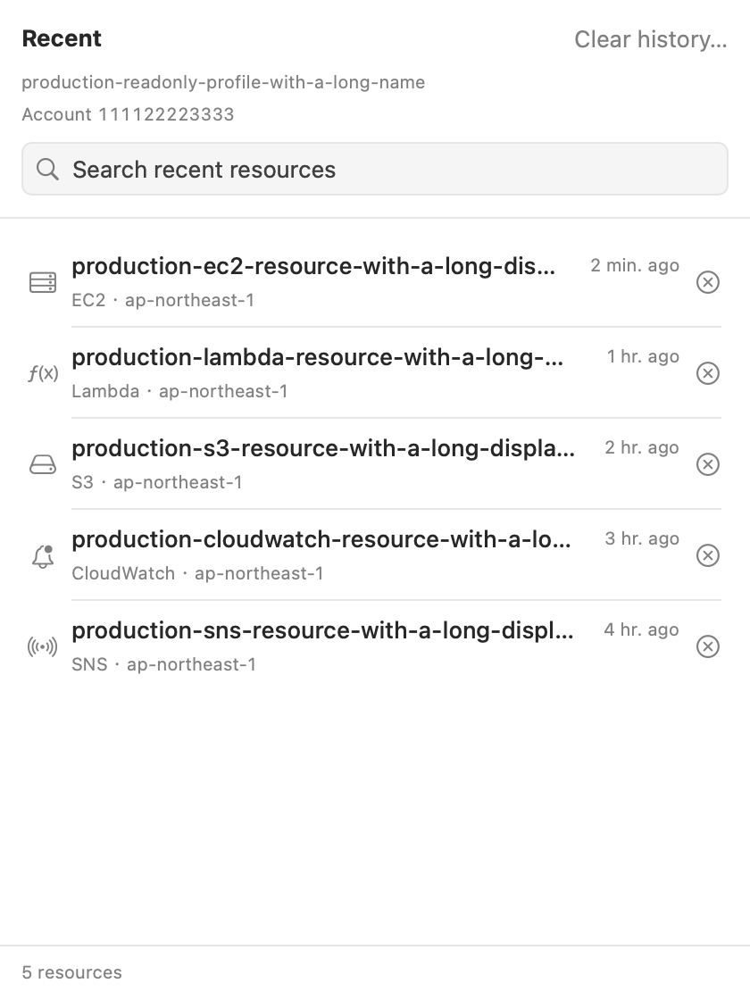

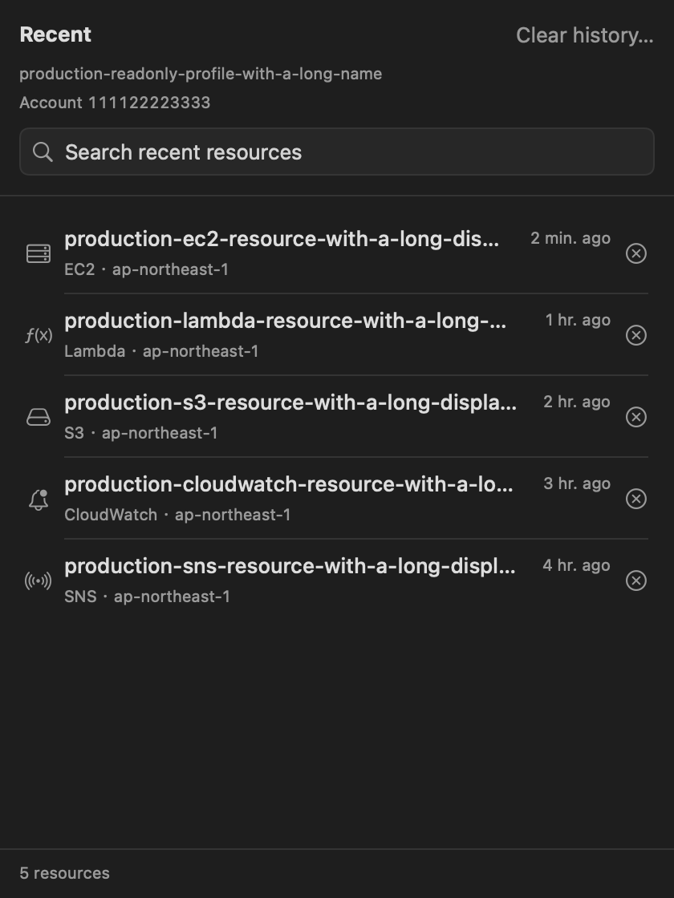

### Security Groups and Resource Relationships

Open `Security Groups` to search by group ID, name, VPC, owner, tags, or rule content and filter by VPC. Select a group to read its metadata, tags, and inbound/outbound rules, including protocols, ports or ICMP type/code, CIDRs, Prefix Lists, and security-group references. The list uses complete pagination, supports refresh/cancel, and labels retained data after a failed refresh. Groups are queried through the current Profile and Region; a visible shared group's owner is shown separately. Groups support favorites and recent history.

Use `View relationships` in an EC2, LB, Target Group, security group, or Hosted Zone detail. Alias and CNAME record rows also provide a record-specific entry. The sheet starts with names and labeled direct relationships; expand a card for its fields, choose `Explore` to follow the next hop, or `Open` to navigate to the exact resource. `Back` restores a previously loaded snapshot; `Refresh` reads it again. Closing the sheet or changing the outer Profile, Region, or resource clears its state. SNS retains its existing relationship viewer.

The view connects LB associations to Target Groups, target registrations to EC2/Lambda/ALB, and EC2/LB bindings to security groups. Security-group references are permission rules, not proof of connectivity. IP targets are not guessed to be EC2. Lambda qualifiers stay visible, while `Open` displays function-level details. Only confirmed same-account security-group references are navigable; shared or unknown owners remain informational.

For Route 53, choose the LB query Region explicitly. A direct Alias match requires both the LB DNS name and its canonical Hosted Zone ID; a CNAME match requires an exact direct DNS target. Matching handles case, a trailing dot, and the ALB `dualstack.` variant without guessing from a suffix or resolving DNS chains. Weighted/failover records keep their routing identifiers. An unmatched target is shown as unmatched in that query scope, not as a nonexistent resource. Opening a matched regional resource changes the workspace Region explicitly and revalidates the current Profile's identity; opening a global Route 53 record preserves the workspace Region and places the exact record at the top of Records, expanded, with other records below.

Reverse queries run only when requested: EC2 scans instance-type Target Groups, a security group finds attached EC2 instances (including secondary network interfaces) and LBs, and an LB scans Hosted Zones for direct DNS references. Zone scans use at most four concurrent record queries and report successful/total checks plus failed zones; incomplete results are never presented as a complete absence of relationships. No other Profile or every-Region inventory is queried automatically. These are configuration relationships, not observed traffic or DNS propagation checks.

Security groups and instance relationships require `ec2:DescribeSecurityGroups` and `ec2:DescribeInstances` with `Resource: "*"`; ELBv2 and Route 53 relations reuse the read permissions documented below. See the [EC2 IAM reference](https://docs.aws.amazon.com/service-authorization/latest/reference/list_ec2.html), [security-group rules](https://docs.aws.amazon.com/vpc/latest/userguide/security-group-rules.html), and [Route 53 Alias targets](https://docs.aws.amazon.com/Route53/latest/APIReference/API_AliasTarget.html). No security-group rules or DNS records are changed.

Component previews use simulated data:

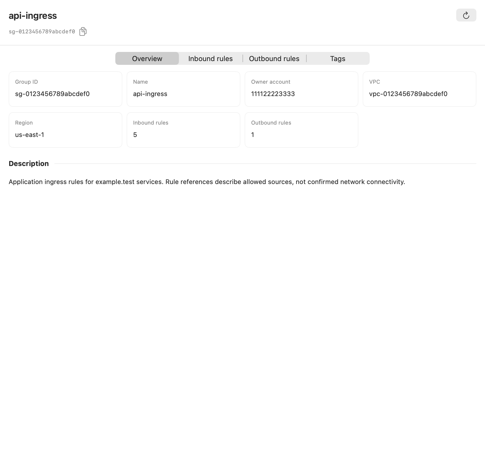

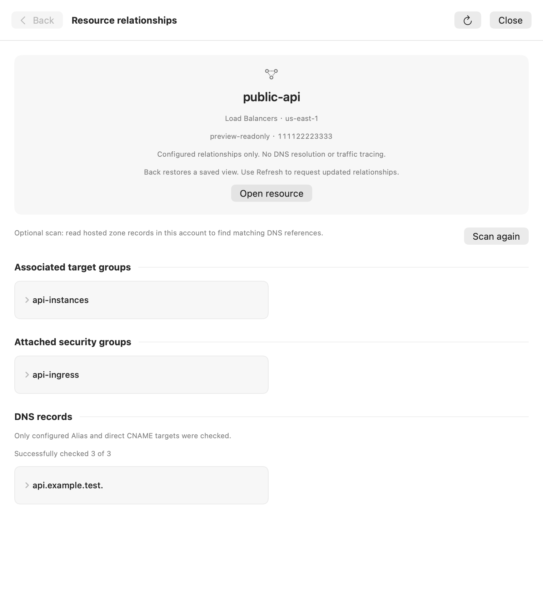

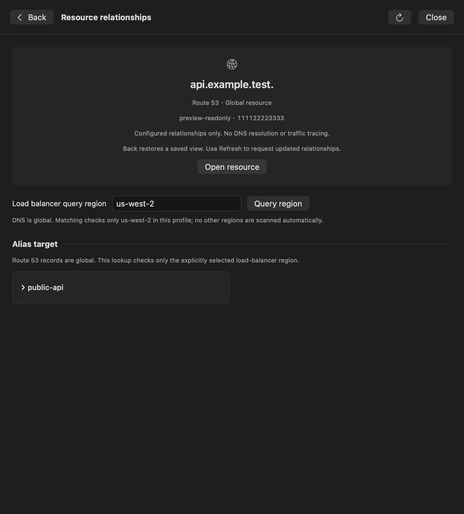

### Load Balancers and Target Groups

Select and verify a Profile and Region, then open `Load Balancers` or `Target Groups` in the sidebar. These ELBv2 pages cover Application, Network, and Gateway Load Balancers for that account and Region. Lists support local search and type filters; select a resource explicitly to read its details. No Profile means no queries. Load balancers and Target Groups can be saved in favorites and recent history by ARN and Region.

A load balancer shows its DNS name, scheme, state, network configuration, listeners, and associated Target Groups. Listeners show protocol, port, TLS configuration, and default actions. Selecting an ALB listener loads its rules, including priority, conditions, transformations, and ordered actions. Forward actions expose every weighted Target Group; redirects, fixed responses, and authentication actions remain distinct. Authentication secrets and extra authentication parameters are excluded from the app's models. These links describe configuration, not observed traffic.

Target Groups show their protocol, target type, health-check configuration, and associated load balancers. Registered targets include their port, availability zone, health state, reason, and description when returned. `Open` follows an exact resource in the same Profile, account, and Region: an instance target opens EC2, a Lambda target opens the function, and an ALB target opens the load balancer. IP targets are displayed without guessing an EC2 association. A Lambda alias/version remains visible in the target ARN; the link opens function-level details rather than a qualified invocation view. Missing resources and failed requests show an error without selecting a substitute.

In EC2 details, the `Target Groups` tab offers an explicit membership query. It lists Target Groups in the current Region, reads health for instance-type groups with up to four concurrent requests, and matches the exact registered instance ID, preserving multiple registered ports. It excludes `Target.NotRegistered` results. Results show successful checks and per-group failures; an incomplete scan is not treated as proof that the instance has no memberships. This scan runs only when requested and does not alter the main Target Group list or favorites.

Lists and dependent data load on demand, paginate completely, and support manual refresh and cancellation without polling. Failed list refreshes mark retained data as potentially stale; listeners, rules, and target health have separate failure states. Profile, account, or Region changes clear old state and invalidate in-flight results. Opening a related resource stays in the current scope, and never selects another Profile automatically.

The role needs `elasticloadbalancing:DescribeLoadBalancers`, `elasticloadbalancing:DescribeTargetGroups`, `elasticloadbalancing:DescribeListeners`, `elasticloadbalancing:DescribeRules`, and `elasticloadbalancing:DescribeTargetHealth` with `Resource: "*"`. See the [ELBv2 IAM reference](https://docs.aws.amazon.com/service-authorization/latest/reference/list_elbv2.html), [listener actions](https://docs.aws.amazon.com/elasticloadbalancing/latest/APIReference/API_Action.html), and [target health](https://docs.aws.amazon.com/elasticloadbalancing/latest/APIReference/API_TargetHealth.html). The app performs read operations only.

Component previews use simulated data:

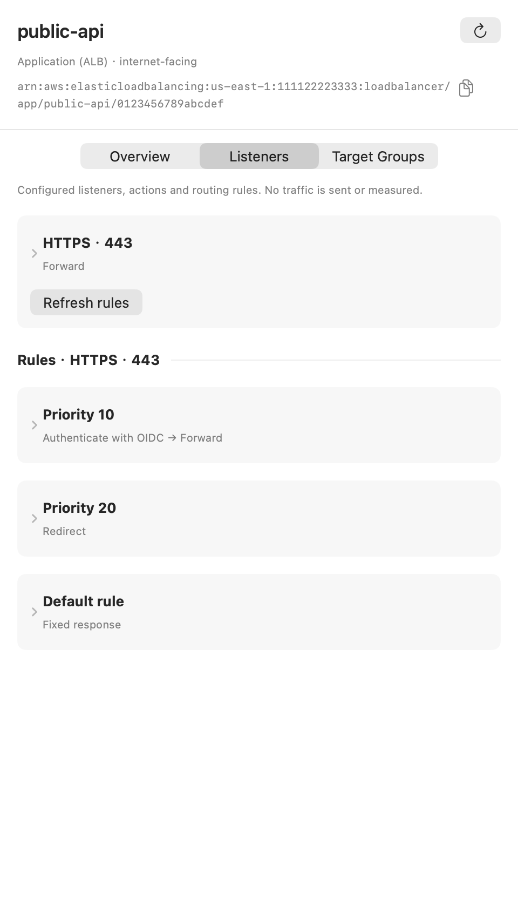

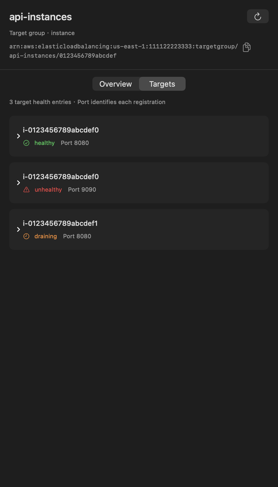

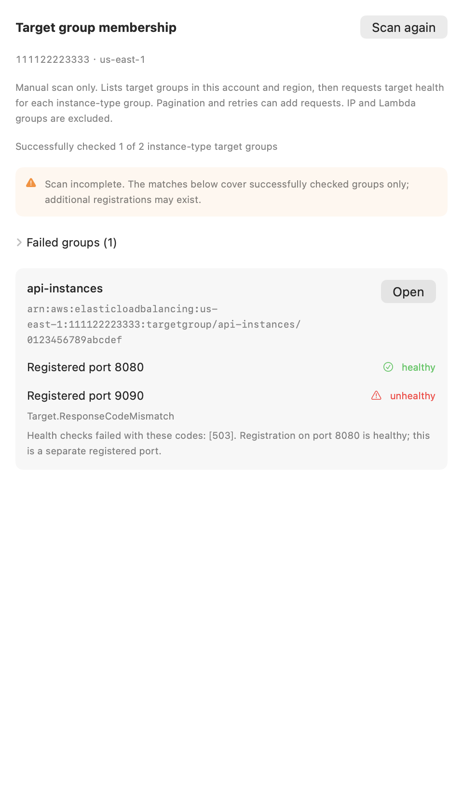

### Route 53

After selecting and verifying a Profile, open `Route 53` in the sidebar to browse that account's public and private Hosted Zones. Route 53 is global within the Profile's AWS partition: this page hides the resource Region selector, and changing resource Regions elsewhere does not reload its data. The commercial, China, and GovCloud partitions use their corresponding SDK endpoints. No Profile means no queries or displayed resources.

Search by zone name or ID, filter by public/private, and select a zone to open `Overview`, `Records`, and `Tags`. Overview shows the Zone ID, comment, record count, caller reference, delegation name servers for public zones, and returned VPC associations for private zones. Name servers and VPC associations describe AWS configuration, not a live DNS test or an inventory of VPC resources. Tags, metadata, and records load independently; a failure in one does not hide the others.

Records support local search and type filtering. Expand a record to read its original values, TTL, Alias target and target health evaluation, routing identifier, and applicable weighted, latency, failover, geolocation, geoproximity, multivalue, or IP-based routing settings. Health check and traffic policy identifiers are displayed without querying those resources. Alias records can omit TTL. Values, including TXT quoting and escapes, are preserved. This is the latest API configuration and can include pending DNS changes; it does not verify propagation.

Lists load on first entry, with complete pagination and no scheduled polling. Use `Refresh` to reload and `Cancel` to stop waiting. A failed zone-list refresh labels retained data as stale; incomplete record pagination is not displayed as a complete result. Profile/session changes, signing in again, and connection retries clear the old state and invalidate in-flight requests. Hosted Zones support favorites and recent history using `global` plus the Zone ID, without changing your selected resource Region. Individual records are not saved as separate favorites or history entries.

The role needs `route53:ListHostedZones` on `Resource: "*"`, plus `route53:GetHostedZone`, `route53:ListResourceRecordSets`, and `route53:ListTagsForResource` for the permitted Hosted Zone resources. See the [Route 53 IAM reference](https://docs.aws.amazon.com/service-authorization/latest/reference/list_route53.html), [record-set API](https://docs.aws.amazon.com/Route53/latest/APIReference/API_ListResourceRecordSets.html), and [service endpoints](https://docs.aws.amazon.com/general/latest/gr/r53.html). The app does not edit DNS records, register domains, or run Resolver queries.

The following component previews use mock Route 53 data:

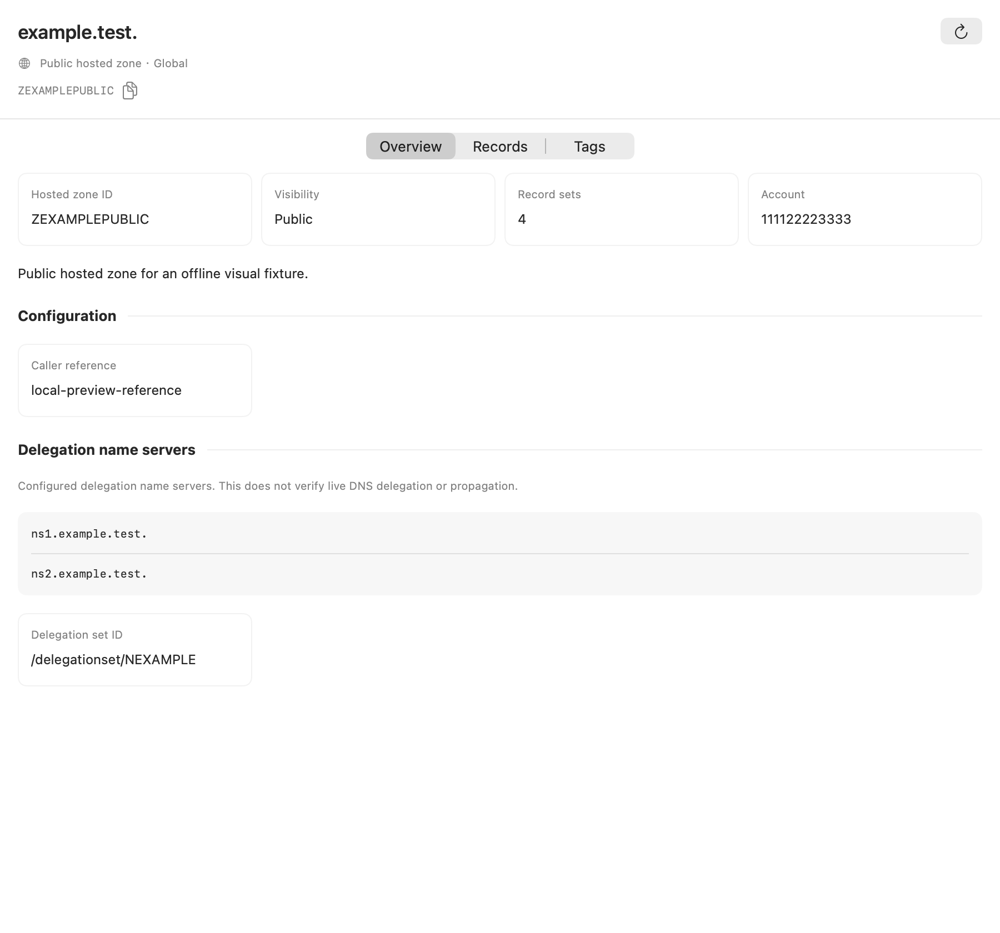

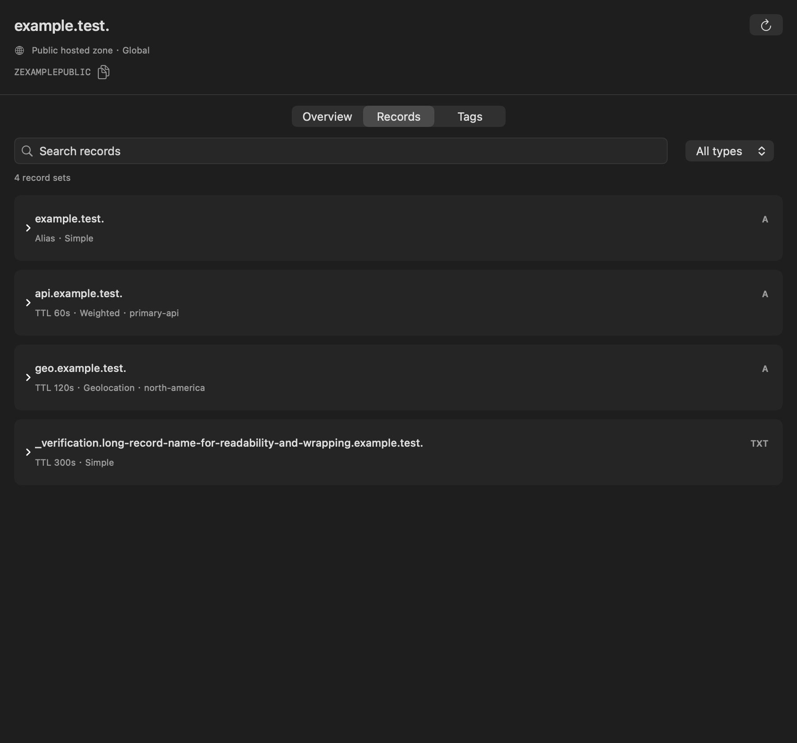

### Cost Dashboard

After manually selecting and verifying a Profile, open `Costs` in the sidebar (`Cmd+Shift+B`) to load costs for the first time. The dashboard shows month-to-date costs, the previous full month's costs, daily trends, and a service breakdown for the selected period. It uses `UnblendedCost` and preserves AWS's currency, negative refunds, and `Estimated` status. Missing data is displayed separately from an actual zero cost.

Every cost request is restricted to the current Profile's STS-verified account through a `LINKED_ACCOUNT` filter. Management accounts also show only their own costs, without automatically aggregating organization members. The Profile's role must still have billing access. No requests are made without a selected Profile. Changing the Profile or session, signing in again, or retrying the connection clears the cost cache.

Date options include the current month, previous month, last 30 days, and a custom range. Queries use complete UTC days and exclude the unfinished current day; the current month and the preceding 12 months are available. At the start of a month, before any complete day is available, month-to-date costs remain blank while the previous month is still available. Daily trends and service breakdowns use the selected dates; the two summary cards always show the current and previous months as of the query time. The billing Region filter is independent of the resource Region and defaults to all regions. Its options come from AWS billing dimensions, and it applies to summaries, trends, and service breakdowns. The standard AWS partition uses the global Cost Explorer endpoint, `ce.us-east-1.amazonaws.com`; the China partition uses the SDK's corresponding China endpoint. Other partitions are shown as unsupported.

Click `Apply` after changing filters to run a query. `Refresh` forces a reload using the applied filters. The eight most recent successful result sets for the current Profile are cached only in memory. Returning to an already loaded page does not repeat requests; failures and cancellations require a manual retry. The cache has no scheduled refresh and is not written to disk. The page displays the retrieval time, and a failed refresh keeps the previous results for the same query while showing an error. `Cancel` stops waiting and prevents further pagination; requests already completed may still incur charges.

Before use, enable Cost Explorer in the AWS console and grant the current role `ce:GetCostAndUsage`, `ce:GetDimensionValues`, and the corresponding billing access. Cost data is delayed and may be revised; it is neither real-time spending nor a final invoice. The app does not enable the service automatically. Missing permissions, unavailable data, throttling, expired login sessions, and incomplete responses produce messages. A pagination failure never presents partial amounts as a complete total.

**Cost Explorer API calls incur charges.** A single load usually makes multiple calls for summaries, daily details, and Region dimensions, and may include pagination or automatic SDK retries. The page counts logical calls and pagination requests, excludes SDK retries, and does not estimate your bill. For current prices and activation rules, see [AWS Cost Explorer pricing](https://aws.amazon.com/aws-cost-management/aws-cost-explorer/pricing/), the [activation guide](https://docs.aws.amazon.com/cost-management/latest/userguide/ce-enable.html), and the [API documentation](https://docs.aws.amazon.com/cost-management/latest/userguide/ce-api.html).

The following component preview uses mock cost data:

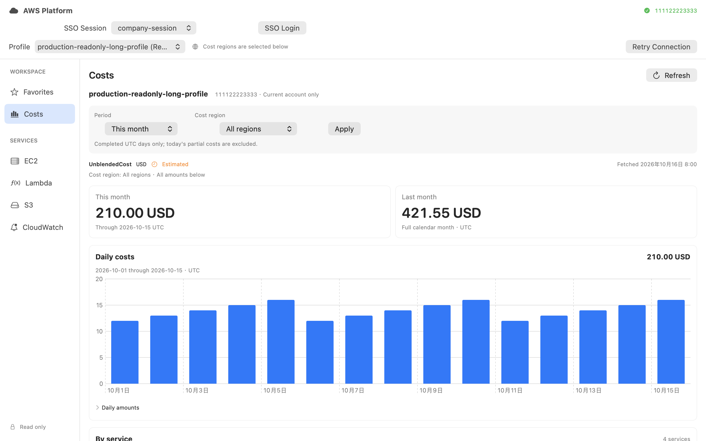

### AWS Health Events

After manually selecting and verifying a Profile, open `Health` in the sidebar. It loads account-specific events across all regions for that account, including upcoming scheduled changes. Public events are excluded, and management accounts do not aggregate organization members. No queries run without a selected Profile. The resource Region selector is hidden on this page; changing a resource Region elsewhere does not reload Health. The commercial, China, and GovCloud partitions use their respective Health endpoints.

Search by event type, ARN, service, or Region, and filter locally by status, category, service, and event Region. Select an event to read its latest description, metadata, times in UTC, and affected resources. Details and affected resources load independently and show separate errors. Missing values remain explicitly unavailable. This is a list of AWS Health events and their latest state, not a history of every update to each event.

The list loads on first entry and stays in memory when you return. Use `Refresh` to reload or `Cancel` to stop waiting; there is no scheduled polling. Changing or clearing the Profile, changing the session, signing in again, or retrying the connection clears the old results and invalidates old requests. Pagination failures do not present partial lists as complete results; a failed refresh labels the previous list as potentially out of date.

AWS Health API access requires an eligible AWS Support plan. Accounts without access receive a specific message and can still check events in the AWS Health console. The role needs `health:DescribeEvents`, `health:DescribeEventDetails`, and `health:DescribeAffectedEntities`; access failures identify the relevant permission. See the [Health API access requirements](https://docs.aws.amazon.com/health/latest/ug/health-api.html) and [event query API](https://docs.aws.amazon.com/health/latest/APIReference/API_DescribeEvents.html).

The following component previews use mock Health data:

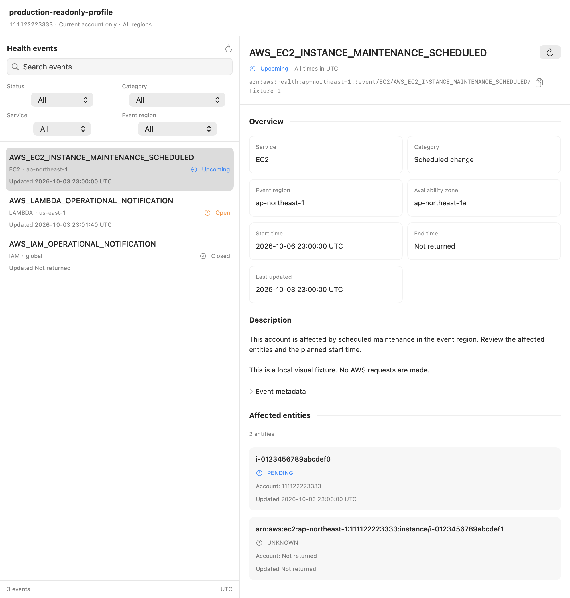

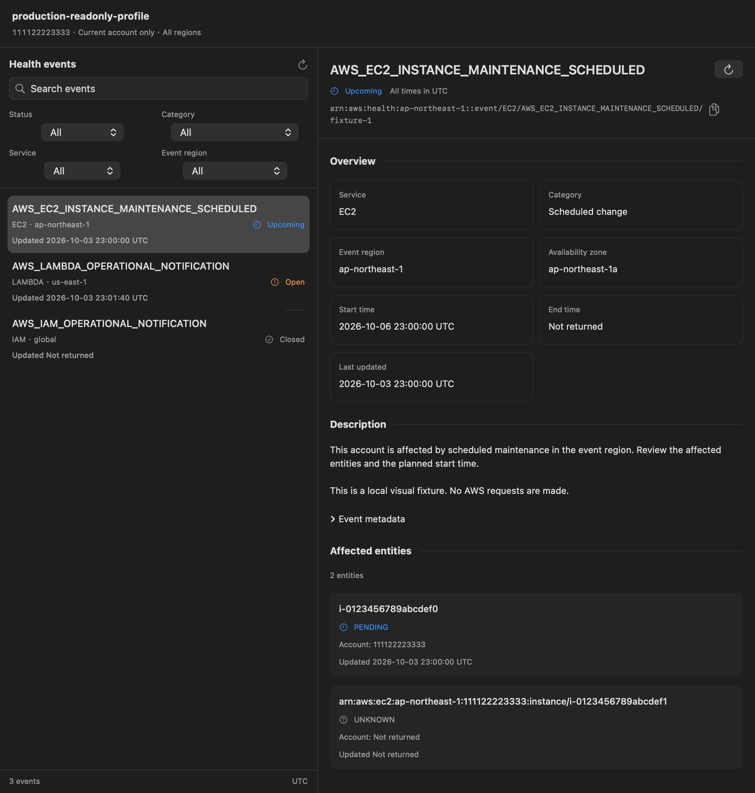

### CloudWatch Alarms

After manually selecting a Profile and Region, open `CloudWatch` in the sidebar to view Metric and Composite Alarms for the current account and Region. The list loads on first entry and supports searching by name, ARN, or metric, filtering by state and type, manual refresh, and cancellation. Returning to the same loaded page does not repeat requests, and there is no scheduled polling. No queries run without a selected Profile. Changing the Profile, Region, or session clears the old list and details.

The first alarm is not selected automatically. Select an alarm to view:

- `Overview`: state, reason, update time, most recent state transition, description, and tags.
- `Configuration`: a single metric, dimensions, Metric Math or Metrics Insights expressions, thresholds, and evaluation settings, or a Composite Alarm's rule and action suppression settings.
- `Actions`: target ARNs for ALARM, OK, and INSUFFICIENT_DATA, and whether actions are enabled. For an SNS Topic in the same account and Region, click `Open SNS topic` to open its details in the app. Other targets remain available as configuration text.
- `History`: the last 30 days of history in reverse chronological order, including state changes, configuration changes, and action records, with expandable returned details.

Tags and history are fetched only for the selected alarm. Each shows its own error if loading fails, while the base configuration remains available. Use the refresh button at the top right of the details to retry. Pagination failures do not present partial lists or history as complete results. Alarms can be saved in local favorites and are identified by ARN. You must still manually select the matching Profile and verify the account; deleted alarms or permission failures leave the favorite intact and display a message.

The role needs `cloudwatch:DescribeAlarms`; history and tags additionally require `cloudwatch:DescribeAlarmHistory` and `cloudwatch:ListTagsForResource`, respectively. To retrieve Composite Alarms, the first two permissions must allow `Resource: "*"` rather than being restricted to individual alarm ARNs. Visibility remains subject to the current role's permissions. See [DescribeAlarms](https://docs.aws.amazon.com/AmazonCloudWatch/latest/APIReference/API_DescribeAlarms.html), [DescribeAlarmHistory](https://docs.aws.amazon.com/AmazonCloudWatch/latest/APIReference/API_DescribeAlarmHistory.html), and [ListTagsForResource](https://docs.aws.amazon.com/AmazonCloudWatch/latest/APIReference/API_ListTagsForResource.html).

The alarm page reads only Metric and Composite Alarm configuration and history; Log Alarms are not supported. Metric charts are available in the `Metrics` tab of EC2 and Lambda details. The app does not create, delete, enable, disable, or change the state of alarms, or publish messages to SNS.

The following component preview uses mock alarm data:

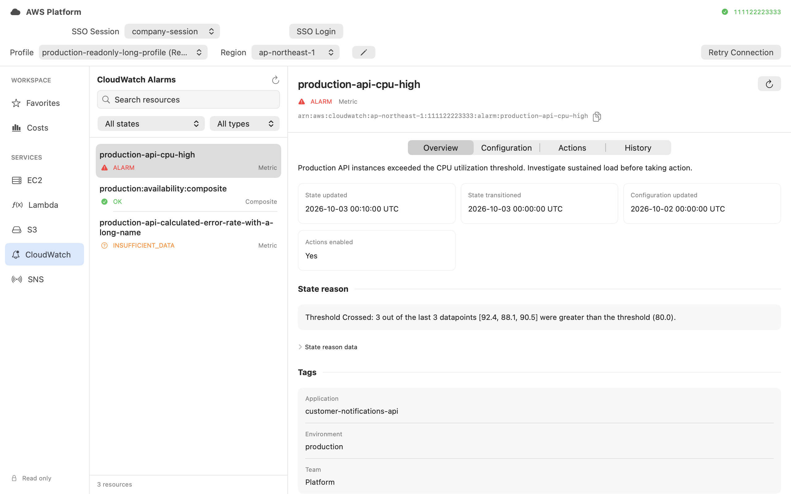

### SNS Topics

After manually selecting and verifying a Profile, open `SNS` in the sidebar to view Topics for the current account and Region. The view supports searching by name or ARN, filtering Standard and FIFO Topics, manual refresh, and cancellation. The list loads only on first entry, has no scheduled polling, and does not automatically select the first item. No queries run without a selected Profile. Changing the Profile, Region, or session clears old data. Topics can be saved in local favorites and located by ARN, following the same manual Profile selection and account verification rules.

Selecting a Topic loads its attributes, tags, and subscriptions independently; a failure affects only the corresponding section:

- `Overview`: Topic identity, display name, owner, subscription counts, and tags.
- `Configuration`: encryption, FIFO, tracing, and other settings returned by AWS, plus expandable access, delivery, and archive policies. Missing fields are explicitly shown as not returned, rather than assumed to be disabled or zero.
- `Subscriptions`: protocol, status, owner, ARN, and endpoint. Confirmed, Pending confirmation, Deleted, and Unknown states are distinguished. Valid cross-account subscriptions retain owner information without switching to or querying the subscriber's account.

Endpoints are hidden by default. Reveal an endpoint manually to copy it; switching Topics hides endpoints again. Tags, attributes, and subscriptions remain only in the current window's memory and are not stored in favorites. Pagination failures do not display partial Topic or subscription lists. The refresh button at the top right retries all three detail groups; switching tabs does not repeat requests.

Required permissions are `sns:ListTopics` with `Resource: "*"`, plus `sns:GetTopicAttributes`, `sns:ListTagsForResource`, and `sns:ListSubscriptionsByTopic` for the relevant Topic. Returned attributes may vary with permissions. The list is queried for the current Profile's account and does not automatically include Topics shared by other accounts. See the [SNS permissions table](https://docs.aws.amazon.com/service-authorization/latest/reference/list_sns.html), [Topic attributes](https://docs.aws.amazon.com/sns/latest/api/API_GetTopicAttributes.html), and [Topic subscriptions](https://docs.aws.amazon.com/sns/latest/api/API_ListSubscriptionsByTopic.html).

This module does not publish messages, create or delete Topics, subscribe, unsubscribe, confirm subscriptions, or modify configuration. Navigation from CloudWatch actions locates Topics only within the current Profile and Region; it never switches accounts or Regions. Missing targets and access failures produce messages.

Click the relationship-view button (「调用链查看」) in Topic details to open a dialog showing configured relationships as **CloudWatch alarms → current SNS Topic → subscription targets**:

- Initially, resource nodes show only their names. Click a name to expand its configuration details, then click `Open alarm` or `Open Lambda function` to navigate to that service. Nodes expand and collapse independently. Longer scope explanations are under the collapsed `About this view` section. Navigable Lambda subscriptions show the function name; other subscriptions use their protocol name, keeping email addresses, phone numbers, and URLs out of node titles.
- Upstream discovery reads Metric and Composite Alarms for the current Profile and Region, matching ALARM, OK, and INSUFFICIENT_DATA actions exactly. It shows whether actions are enabled and any returned suppression settings. Each dialog opening performs one complete paginated check, which can also be refreshed separately. This requires `cloudwatch:DescribeAlarms`, with `Resource: "*"` for Composite Alarms. Permission or query failures are marked as an incomplete check, rather than treated as no sources.
- Downstream nodes reuse subscriptions already loaded in Topic details and show their confirmation status when expanded. To update subscriptions, close the dialog and refresh Topic details. Raw endpoints remain hidden by default and must be revealed before copying. Valid Lambda nodes can open function details immediately after expansion without revealing the endpoint.
- Alarms and confirmed Lambda subscriptions can open their details in the app, but only within the same verified Profile, account, Region, and partition. Navigation does not save favorites, select a Profile automatically, or change the Region. Targets outside this scope, unconfirmed subscriptions, and services without a detail view are displayed as information only. Lambda aliases and versions remain visible, but navigation opens the function's details rather than a dedicated alias or version view.

This view shows configured relationships. It does not prove that messages were sent or delivered successfully, and it is not a complete list of publishers. S3 notifications, Lambda asynchronous destinations, and `Publish` calls in application code are outside the current scan. Topic policies are not treated as evidence of a publisher. Actual SNS publish records require separately enabling and querying CloudTrail data events; the default event history does not include them. See [CloudWatch alarm queries](https://docs.aws.amazon.com/AmazonCloudWatch/latest/APIReference/API_DescribeAlarms.html) and [SNS CloudTrail documentation](https://docs.aws.amazon.com/sns/latest/dg/logging-using-cloudtrail.html).

The following component previews use mock SNS data:

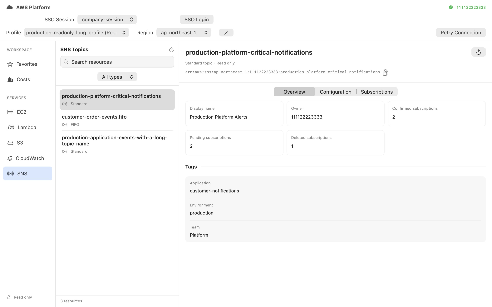

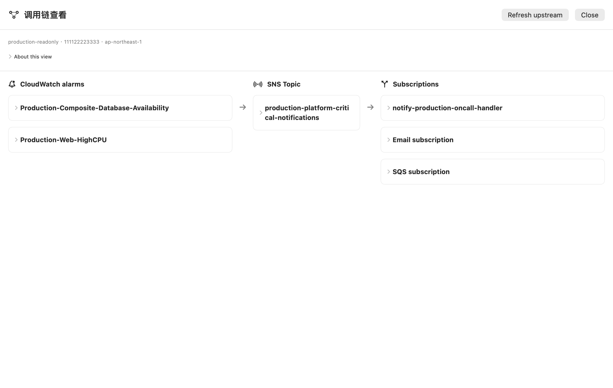

### EC2 and Lambda Metrics, and Lambda Logs

Open `Metrics` in resource details, select the last 1, 6, or 24 hours, then click `Load metrics`. Each query retrieves four metrics in one batch with five-minute aggregation. The window ends at the most recent complete five-minute boundary, and all times are displayed in UTC. `Refresh` reloads data manually; there is no polling. Empty samples remain empty, gaps in data break the chart lines, and partial data and permission failures are labeled separately.

| Resource | Metric | Aggregation and unit |
| --- | --- | --- |
| EC2 | CPUUtilization | Average, percent |
| EC2 | NetworkIn / NetworkOut | Sum, bytes per five minutes |
| EC2 | StatusCheckFailed | Maximum, status check failure value |
| Lambda | Invocations / Errors / Throttles | Sum, count per five minutes |
| Lambda | Duration | Average, milliseconds |

Lambda metrics use the function-name dimension and include that function's versions and aliases. Metrics require `cloudwatch:GetMetricData`; missing data is not assumed to be zero. See [EC2 metrics](https://docs.aws.amazon.com/AWSEC2/latest/UserGuide/viewing_metrics_with_cloudwatch.html), [Lambda metrics](https://docs.aws.amazon.com/lambda/latest/dg/monitoring-metrics-types.html), and [GetMetricData](https://docs.aws.amazon.com/AmazonCloudWatch/latest/APIReference/API_GetMetricData.html).

The Lambda `Logs` tab becomes available after the function configuration loads successfully. Select a time range, optionally enter a CloudWatch filter pattern using AWS syntax, then click `Search`. Results show the event time, log stream, ingestion time, and selectable multiline message text. Long messages initially show a preview and can be expanded in full. Changing the time range or filter clears the previous search and requires another click on `Search`.

The log group comes from the function's `LoggingConfig.LogGroup`, falling back to `/aws/lambda/<functionName>` if no custom group is configured. For custom groups, the app first enumerates all log streams, strictly matches the current function name, then reads matching streams in batches. Failed enumeration never falls back to reading the entire shared group. Required permissions are `logs:FilterLogEvents`, plus `logs:DescribeLogStreams` for custom log groups. Reading function configuration uses `lambda:GetFunction`. See [Lambda log groups](https://docs.aws.amazon.com/lambda/latest/dg/monitoring-cloudwatchlogs-loggroups.html) and [FilterLogEvents](https://docs.aws.amazon.com/AmazonCloudWatchLogs/latest/APIReference/API_FilterLogEvents.html).

Click `Load more` to continue pagination for the same query. Loaded events appear in reverse chronological order. Until pagination completes, the view explicitly marks the results as partial and does not call them the latest logs for the entire time range. It retains at most 5,000 events or 8 MiB of UTF-8 message text; a message that would exceed the limit is omitted in full. If a size or pagination safety limit is reached, narrow the time range or add a filter. AWS data masking is preserved, and the app does not request permission to unmask logs.

Metrics and logs call APIs only when explicitly loaded and may incur CloudWatch usage charges. Click `Cancel` during loading to stop waiting and prevent further requests; completed requests cannot be undone. Credentials, account, and role come from the current manually selected and verified Profile, and the Region comes from the current resource. No requests run without a selected Profile. Switching resources, Profiles, or Regions, or leaving the tab, cancels the wait and clears in-memory results; late responses are ignored. Metrics and logs are not written to favorites, disk, or application diagnostic logs.

The following component previews use mock monitoring data:

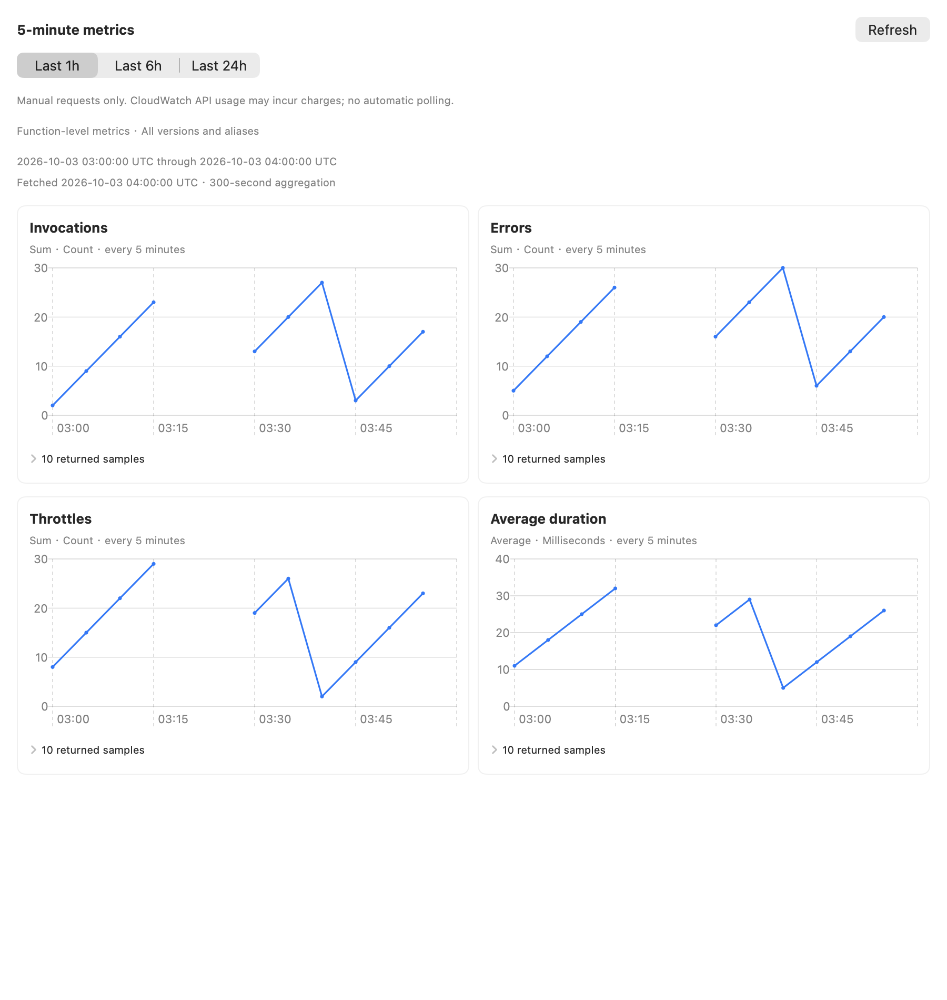

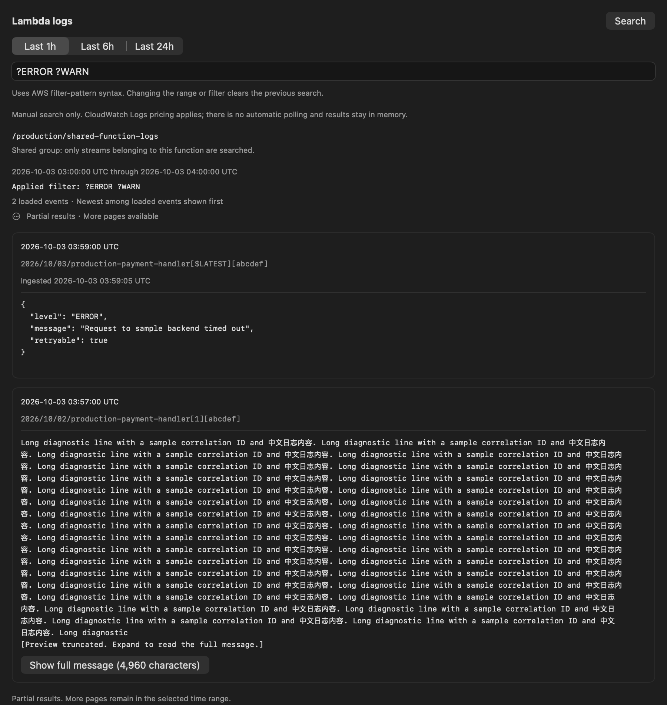

### In-App SSO Login

1. Choose a configured session in `SSO Session` and click `SSO Login`. The app runs the local `aws sso login --sso-session <name>` command in the background, and AWS CLI opens the default browser for authorization. No terminal window opens, and you do not need to select a Profile first.
2. After a successful login, the Profile remains `Select profile`, resource lists and details stay empty, and no account identity verification or resource queries are sent.
3. Only after you manually select a Profile associated with that session does the app verify your identity and load resources for that Profile's account, role, and Region. Switching sessions, signing in again, or returning the Profile to `Select profile` clears the current selection and resource views.

The app remembers only the last selected named session; a Profile must be selected manually on every launch. Valid AWS CLI login caches can be reused without signing in again. A session with only one Profile still does not select it automatically. You can also sign in to a session before configuring any associated Profiles.

Profiles with regular credentials and legacy SSO Profiles without `sso_session` appear under `Other profiles` and still require manual selection. For legacy SSO, run `aws sso login --profile <name>` in a terminal, then select that Profile or click `Retry Connection`. Network, permission, and configuration errors are shown as connection failures rather than all being labeled as logged out.

Click `Cancel Login` to stop waiting. Switching sessions or closing the view also cancels the wait; Profile and Region selection are disabled during login. Login waits for at most five minutes. Cancellation or timeout terminates the CLI subprocess started for that attempt, without closing the browser, signing out, or deleting existing sessions. Cancellation cannot undo authorization already completed in the browser.

The CLI must be available at `/opt/homebrew/bin/aws`, `/usr/local/bin/aws`, or `/usr/bin/aws`. The app shows a message if it is missing. If the browser does not open, cancel, sign in from a terminal, and then select a Profile manually. Login and credential loading use the same configuration paths. The login subprocess does not inherit `AWS_PROFILE` or `AWS_DEFAULT_PROFILE`, preventing a terminal's preselected account from affecting session login. The app does not display, log, or save the login command's raw output. AWS CLI manages the login cache.

The following component preview simulates a successful login with no Profile selected:

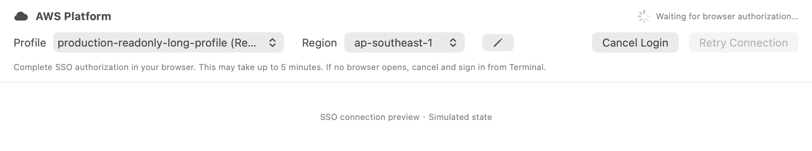

## Project Structure

```
Sources/AWSPlatform/
├── App.swift                    # App entry point
├── ContentView.swift            # Main view
├── Models/                      # Data models
│   ├── AWSProfile.swift
│   ├── AWSSOSession.swift
│   ├── AWSService.swift
│   ├── CloudWatchAlarm.swift
│   ├── SNSTopic.swift
│   ├── CostModels.swift
│   ├── HealthModels.swift
│   ├── Route53Models.swift
│   ├── ELBModels.swift
│   ├── SecurityGroupModels.swift
│   ├── ResourceRelationModels.swift
│   ├── WorkspaceDestination.swift
│   ├── ResourceFavorite.swift
│   ├── RecentResource.swift
│   ├── EC2Instance.swift
│   ├── LambdaFunction.swift
│   └── S3Bucket.swift
├── Services/                    # AWS service layer
│   ├── AWSServiceProvider.swift
│   ├── AWSAlarmService.swift     # CloudWatch alarms, tags, and history
│   ├── AWSSNSService.swift       # SNS Topics, configuration, tags, and subscriptions
│   ├── AWSCostService.swift       # Cost Explorer queries and complete pagination
│   ├── AWSHealthService.swift    # Account-specific Health events, details, and affected resources
│   ├── AWSRoute53Service.swift   # Hosted Zones, DNS records, metadata, and tags
│   ├── AWSELBService.swift       # Load balancers, Target Groups, routing, and target health
│   ├── AWSSecurityGroupService.swift
│   ├── AWSResourceRelationshipService.swift
│   ├── AWSCLICredentialProvider.swift # SSO credential bridge for custom configuration paths
│   └── AWSSSOLoginService.swift  # CLI login process and shared invocation configuration
├── Utilities/                   # Utilities
│   ├── ConfigReader.swift
│   ├── Route53LoadBalancerMatcher.swift
│   └── UserFacingError.swift
├── ViewModels/                  # View models
│   ├── AlarmViewModel.swift
│   ├── SNSViewModel.swift
│   ├── CostViewModel.swift
│   ├── HealthViewModel.swift
│   ├── Route53ViewModel.swift
│   ├── ELBViewModel.swift
│   ├── SecurityGroupsViewModel.swift
│   ├── ResourceRelationshipsViewModel.swift
│   ├── EC2TargetGroupsViewModel.swift
│   ├── ELBResourceNavigation.swift
│   ├── EC2ViewModel.swift
│   ├── FavoriteNavigation.swift
│   ├── FavoritesViewModel.swift
│   ├── RecentResourcesViewModel.swift
│   ├── LambdaViewModel.swift
│   ├── ProfileViewModel.swift
│   └── S3ViewModel.swift
└── Views/                       # UI views
    ├── CloudWatch/
    ├── SNS/
    ├── Cost/
    ├── Health/
    ├── Route53/
    ├── ELB/
    ├── SecurityGroups/
    ├── Relationships/
    ├── EC2/
    ├── Lambda/
    ├── S3/
    ├── FavoritesListView.swift
    ├── RecentResourcesListView.swift
    ├── ProfileBarView.swift
    ├── ServiceSidebarView.swift
    └── SharedViews.swift

Tests/AWSPlatformTests/           # Configuration parsing and ViewModel unit tests
```

## AWS Configuration

Ensure that `~/.aws/config` is correctly formatted:

```ini
[default]
region = us-east-1
output = json

[profile my-profile]
region = ap-northeast-1
output = json
```

AWS CLI `[sso-session ...]` sections appear in the separate `SSO Session` selector, not in the Profile list. Auxiliary sections such as `[services ...]` are not offered as Profiles.

The Profile list merges names from `config` and `credentials`, using settings such as Region from `config` when names match. Profiles found only in `credentials` use the default Region, `us-east-1`. The app supports the process environment variables `AWS_CONFIG_FILE` and `AWS_SHARED_CREDENTIALS_FILE`, using the same paths to discover configuration and create AWS clients. Processes launched from Finder do not automatically inherit temporary environment variables set in a terminal. To use custom paths, you can run `swift run` from a terminal with those variables set.

SSO with the default configuration paths uses Soto's credential provider. SSO with a custom `AWS_CONFIG_FILE` uses the local AWS CLI v2 `configure export-credentials` command. The CLI must be installed at `/opt/homebrew/bin/aws` or `/usr/local/bin/aws` (with `/usr/bin/aws` also supported) and support that command. Credentials are parsed only through an in-memory pipe; command output is not displayed or saved. In-app login automatically receives the same configuration paths. If you log in from a terminal, use the same configuration paths and session, then manually select a Profile. If a Profile is already selected, click `Retry Connection`.

Multiple Profiles can share one named SSO session:

```ini
[profile development]
sso_session = company
sso_account_id = 111122223333
sso_role_name = DeveloperAccess
region = eu-west-1

[profile production]
sso_session = company
sso_account_id = 444455556666
sso_role_name = ReadOnlyAccess
region = ap-southeast-1

[sso-session company]
sso_start_url = https://example.awsapps.com/start
sso_region = us-east-1
sso_registration_scopes = sso:account:access
```

Replace the example values with your configuration, then run `aws sso login --sso-session company` to sign in to the shared `company` session. Selecting `company` in the app makes `development` and `production` available in the Profile list, but you must still choose one manually. Both Profiles can reuse the login while the session is valid and you have access to the corresponding accounts and roles. Each Profile independently determines the account, role, and resource Region; `sso_region` is the IAM Identity Center Region. In the standard format, each Profile references one session. Different sessions require separate logins, and the app does not automatically discover or create Profiles for other accounts. See the [AWS CLI SSO documentation](https://docs.aws.amazon.com/cli/latest/userguide/cli-configure-sso.html).

The Region list includes commonly used regions known to the SDK and regions found in your configuration. You can also enter another Region code using the edit button beside the Region selector. Region activation, partition membership, and service permissions remain governed by AWS.

The Lambda list uses `GetFunction` to supplement function state and tags, fetching at most four functions concurrently. If some functions cannot be read or access is denied, the list remains available with a message. State filters exclude functions with unknown state. Required permissions include at least `lambda:ListFunctions` and `lambda:GetFunction` for the additional information.

When you manually load Lambda source code, the app streams the ZIP into a private system temporary directory, reads its contents in memory, and attempts to remove the temporary directory on success, failure, or cancellation. Archive entries are never extracted to filesystem paths. Viewing source code still creates a temporary ZIP on the local machine.

Source preview is limited to a 50 MiB download, 250 MiB of expanded data, 10,000 file/directory entries, and 10 MiB of cumulative text preview. Each text file retains the existing 200,000-byte preview limit; binary and larger files remain listed without content. Hidden entries are not displayed but still count toward archive limits. Downloads time out after 60 seconds; ZIP processing has a 30-second limit. Use `Cancel` while loading to stop the operation. Switching functions or clearing/changing the Profile invalidates old requests.

Preview supports ordinary, unencrypted, single-disk ZIPs using Store or Deflate. ZIP64, symbolic links, special file entries, alternate path/link metadata, unsafe or duplicate paths, paths over 1,024 bytes or 32 components, and inconsistent sizes or CRCs are rejected with an error. These are local preview limits, not AWS deployment quotas. Container-image functions continue to display image information rather than ZIP source.

References: [AWS CLI credential export](https://docs.aws.amazon.com/cli/latest/reference/configure/export-credentials.html), [AWS CLI environment variables](https://docs.aws.amazon.com/cli/latest/userguide/cli-configure-envvars.html), and [fields returned by the Lambda list API](https://docs.aws.amazon.com/lambda/latest/api/API_ListFunctions.html).

## Project Status

See [`ROADMAP.md`](ROADMAP.md) for the current stage, verification records, and planned work.

## License

Original code in this project is licensed under the [MIT License](LICENSE). Third-party dependencies retain their respective licenses. See [THIRD_PARTY_NOTICES.md](THIRD_PARTY_NOTICES.md) for versions and upstream licenses.

## 工程规范入口

项目约定见 [AGENTS.md](AGENTS.md)，视觉规则见 [DESIGN.md](DESIGN.md)，当前进度见 [ROADMAP.md](ROADMAP.md)。静态检查：`python3 scripts/harness/verify.py --mode task`；推送检查：`scripts/verify-before-push.sh`。设计 lint 使用固定版本 `@google/design.md@0.4.0`，需要 Node.js／npm，工具缓存保存在已忽略的 `.tmp/`。
